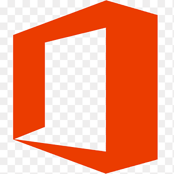
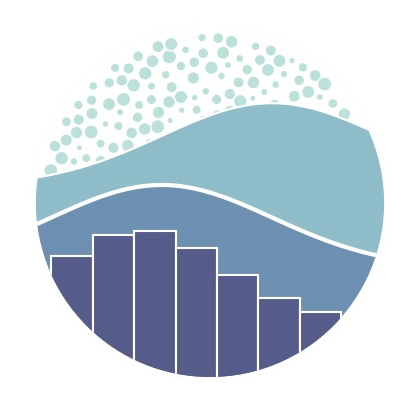
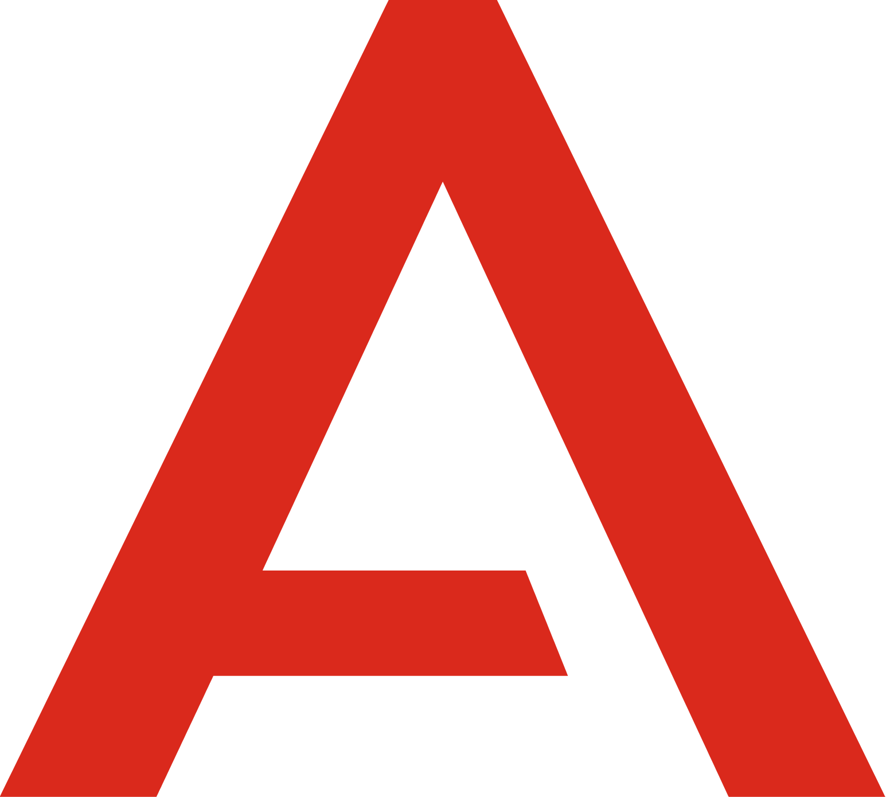

# Welcome! 👋

### 💬About me:
My name is Javier, I’m 32 years old and I’m from Argentina, though I’m currently living in Zagreb. Some years ago, I came to Europe with the idea of traveling around, and have different working experiences in some countries, and when I came to Croatia, I decided to stay for the girl that is now my wife and the mother of my kids.

Recently, I've decided to make a change in my life and learn something new, something that has always been interesting to me and started my journey in the Data Analytics field. I'm passionate about statistics, I like working with data and being able to extract useful insights and make data-driven decisions. Here you can see the courses I've taken by now.

### 🌱I’m currently learning:
-  Financial Analysis on Udemy platform 👨‍💻.

### ⚡My projects:
<a href="https://github.com/Plasma1992/CourseraProject">Coursera EDA</a> | <a href="https://github.com/Plasma1992/SpotifyProject">Spotify EDA</a> | <a href="https://github.com/Plasma1992/ChessAssistant">Python Chess Assistant</a> | Coming soon... | 

### 🛠 Languages & Tools:

 
 

<!--

**Plasma1992/Plasma1992** is a ✨ _special_ ✨ repository because its `README.md` (this file) appears on your GitHub profile.

Here are some ideas to get you started:

- 🔭 I’m currently working on ...
- 🌱 I’m currently learning ...
- 👯 I’m looking to collaborate on ...
- 🤔 I’m looking for help with ...
- 💬 Ask me about ...
- 📫 How to reach me: ...
- 😄 Pronouns: ...
- ⚡ Fun fact: ...
-->
